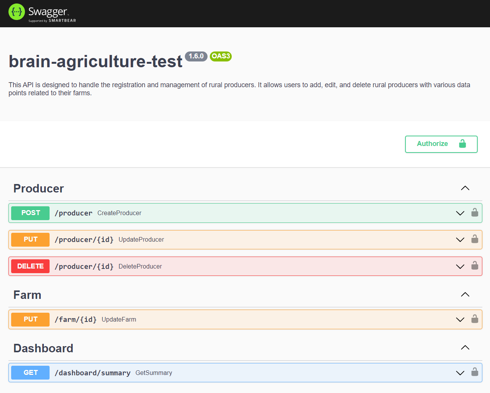
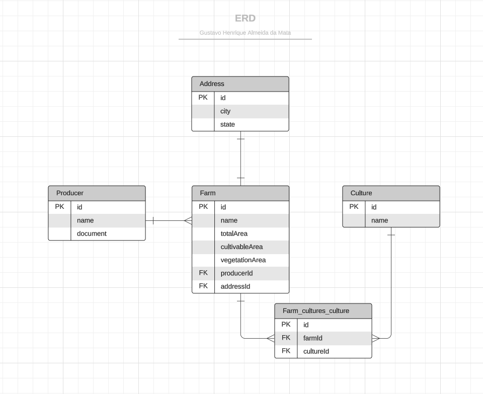

<p align="center">
  <a href="http://nestjs.com/" target="blank"></a>
</p>
<p align="center">A progressive <a href="http://nodejs.org" target="_blank">Node.js</a> framework for building efficient and scalable server-side applications.</p>
<p align="center">

# API for Brain Agriculture Test 🌾🚜

This API is designed to handle the registration and management of rural producers. It allows users to add, edit, and delete rural producers with various data points related to their farms. 

The development process was guided by the principles of Test-Driven Development (TDD), ensuring that each feature and functionality has a high test coverage. Additionally, the project was built following the Clean Architecture approach, prioritizing code quality and maintainability, resulting in a highly organized and scalable codebase.


## Main technologies
<p align="center">
  
  
  
  
  
  
  
</p>

## Documentation

**Swagger docs:**

  The Swagger documentation can be found by running the project and accessing http://localhost:3000/docs/
  


**Database ERD:**
  
## Requirements

- Node.js 
- Docker

## Install


**NPM**
```bash
npm install 
```

**Yarn**
```bash
yarn install
```


**2. Configure environment variables**
  - To run this project, you will need to add the following environment variables to your .env file

    - `POSTGRES_HOST=`
    - `POSTGRES_PORT=`
    - `POSTGRES_USER=`
    - `POSTGRES_PASSWORD=`
    - `POSTGRES_DB=`
    - `NODE_ENV=`
    - `API_AUTH=` <-- basic auth

**3. Build and run the docker**
  - this step can take a while until finish
```bash
  $ docker-compose up --build
```

### 🚀🚀🚀 Thats it!


## Author

⭐ Gustavo Mata [@gusttaswe](https://github.com/gusttaswe)
